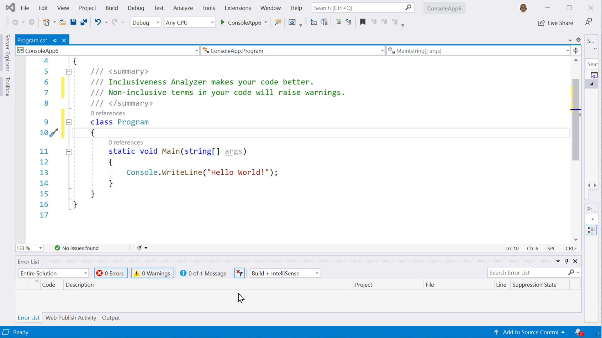

# Inclusiveness Analyzer

> Make your code inclusive!

The Inclusiveness Analyzer is a Visual Studio extension that checks code for offensive /exclusive terms.

It also provides context on why a word is exclusive and suggests alternate terms that can be used instead.



## Installing via the NuGet Package

The Inclusiveness Analyzer can be added to any C# project. Just install using NuGet and start writing code. The extension will be automatically loaded in Visual Studio for anyone that opens your project. Using the NuGet package is best when you are working on a project with a team. 
<https://www.nuget.org/packages/InclusivenessAnalyzer/>

```powershell
    Install-Package InclusivenessAnalyzer
```

> The Inclusiveness Analyzer is only used during development time and does not affect your projects outputs or binaries.

## Installing as a Visual Studio Extension

If you would like the Inclusiveness Analyzer to run on any Visual Studio project you can install the extension directly into Visual Studio.

```
Extensions > Manage Extensions > Search for 'Inclusiveness'
```

Happy inclusive :heart: coding!

Icons made by [Freepik](https://www.flaticon.com/authors/freepik) from [www.flaticon.com](https://www.flaticon.com/)
